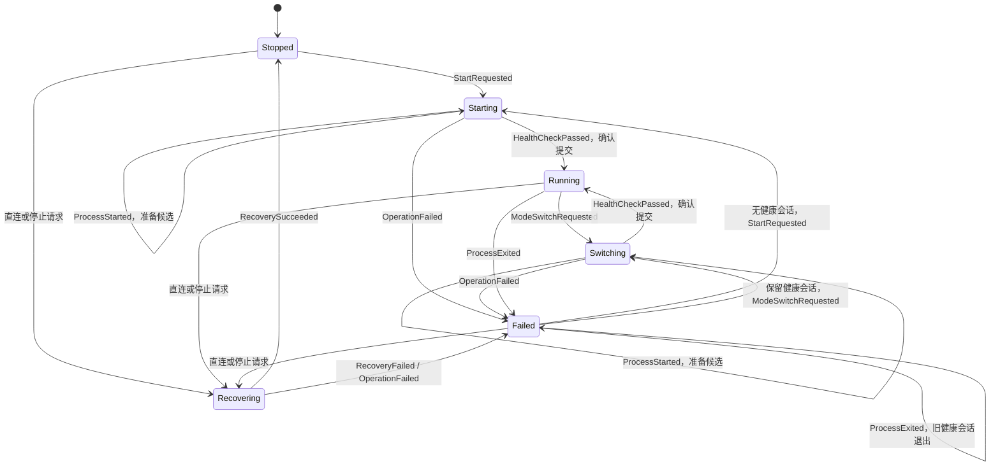

# 运行时状态机

状态节点集中保存已应用会话、模式、起始时间和健康状态。运行时快照从节点派生，IPC 的字段和序列化保持兼容。

`Starting` 和 `Switching` 先于后端 I/O 发布。`ProcessStarted` 只记录通过后端准备的候选会话，不改变已应用模式、修订或运行时长。配置变更等待持久化提交后再发送 `HealthCheckPassed`；普通模式操作在后端健康确认后立即提交。转换函数不执行后端或存储 I/O。

失败切换保留旧健康会话，继续监测其退出；进程退出或网络恢复失败会撤销已应用会话和模式。生命周期错误与最近一次操作结果独立，进程退出不会改写历史操作结果。元数据提交不重启内核；会话健康或未启动时清除操作错误，退出和恢复阻塞时保留生命周期错误。

`Rollback` 在后端撤销候选后恢复完整旧节点，因此保留旧会话和起始时间。无待提交候选的兼容恢复路径重新应用旧配置后，通过 `SnapshotRestored` 恢复快照元数据；目标必须是稳定且满足不变量的节点。`Stopped` 的 `Some(Direct)` 表示直连已应用，`None` 表示显式停止。

节点转换前后检查会话身份、代理模式、健康状态和候选模式。拒绝事件时原节点不变；后端返回无效候选时撤销该候选，撤销失败则记录恢复失败并撤销健康声明。

所有运行时写操作由同一个操作互斥锁串行化。快照读取不等待后端 I/O，过渡期或持久化候选存在时跳过健康对账，避免把准备中的进程视为已应用状态。

`ManagedRuntime::transition_history()` 返回最近 128 次已接受或拒绝的转换，包含时间、操作编号、事件名和前后阶段。历史和 debug 日志不记录配置、会话身份、错误文本、地址或凭据；历史只保存在内存中。
